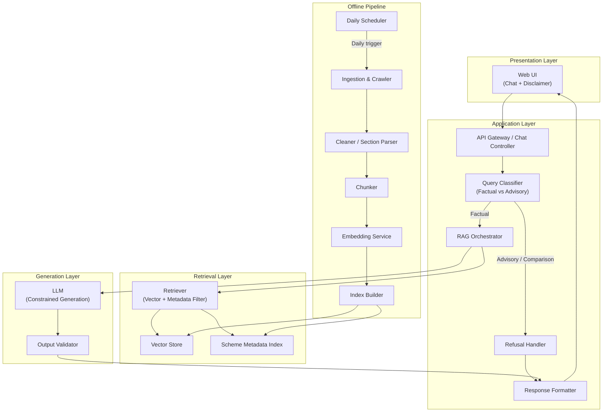
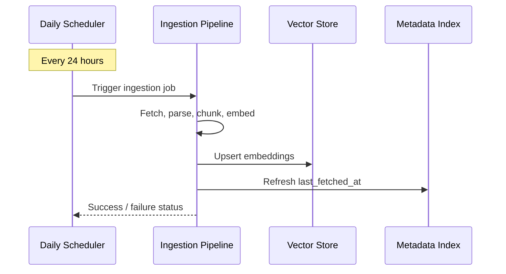
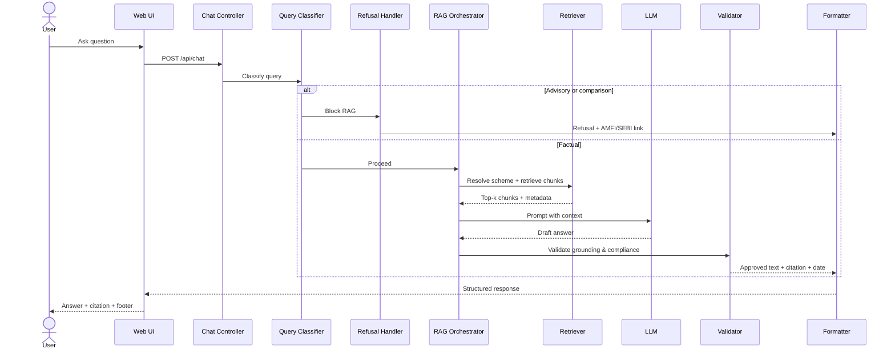
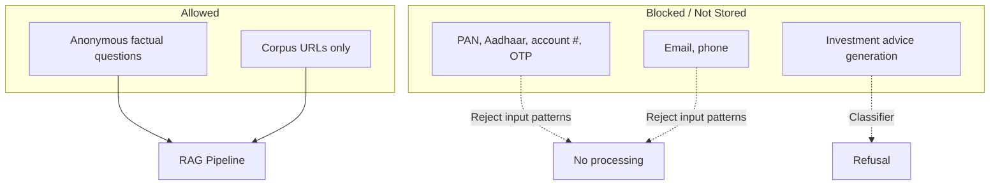

# Architecture: Mutual Fund FAQ Assistant

This document describes the system architecture for a **facts-only, RAG-based FAQ assistant** scoped to five HDFC Mutual Fund scheme pages on Groww. It is derived from [problemStatement.md](./problemStatement.md). Phase-wise build details live in [implementation-plan.md](./implementation-plan.md).

---

## 1. Design Goals

| Goal | Architectural implication |
|------|-------------------------|
| Facts-only answers | Retrieval grounded in corpus; LLM constrained by system prompt and post-generation validation |
| Source-backed responses | Every answer carries exactly one citation URL from the active corpus |
| Compliance | Advisory/comparison queries are classified and refused before or instead of retrieval |
| Accuracy over intelligence | Prefer retrieved text over model inference; narrow corpus (5 URLs) reduces hallucination risk |
| Transparency | Fixed response format: ≤3 sentences + citation + `Last updated from sources: <date>` footer |
| Privacy | Stateless chat; no PII collection or persistence |

---

## 2. High-Level Architecture



**Request path (online):** User question → classify → retrieve relevant chunks → generate grounded answer → validate → format → display.

**Index path (offline):** A **daily scheduler** triggers the ingestion pipeline → fetch 5 Groww pages → parse into structured sections → chunk → embed → persist to vector store and metadata index.

---

## 3. System Components

### 3.1 Presentation Layer (Minimal UI)

A lightweight single-page chat interface inspired by Groww's mutual fund detail pages as reference context.

**Responsibilities:**

- Display welcome message and disclaimer: **"Facts-only. No investment advice."**
- Show three clickable example questions (covering scheme facts and fund management)
- Accept free-text user queries
- Render assistant replies with citation link and last-updated footer
- Never prompt for or accept PII (PAN, Aadhaar, account numbers, OTP, email, phone)

**Suggested example questions:**

1. *What is the expense ratio of HDFC Mid Cap Fund Direct Growth?*
2. *What is the exit load on HDFC Defence Fund Direct Growth?*
3. *Who manages HDFC Gold ETF Fund of Fund Direct Plan Growth?*

---

### 3.2 Application Layer

#### Chat Controller (Express route)

- Exposes a single endpoint, e.g. `POST /api/chat`
- Accepts `{ "message": string }` only — no session identifiers tied to identity
- Routes to classifier, then RAG or refusal path
- Returns structured JSON for the UI to render

```json
{
  "answer": "The expense ratio of HDFC Mid Cap Fund Direct Growth is 0.73%.",
  "citation_url": "https://groww.in/mutual-funds/hdfc-mid-cap-fund-direct-growth",
  "last_updated": "2026-05-29",
  "is_refusal": false
}
```

#### Query Classifier

Runs **before** retrieval to enforce compliance.

| Class | Examples | Action |
|-------|----------|--------|
| **Factual** | Expense ratio, exit load, min SIP, benchmark, fund manager name/tenure/experience | Proceed to RAG |
| **Advisory** | "Should I invest?", "Is this a good fund?" | Refusal handler |
| **Comparison** | "Which fund is better?", "Mid cap vs large cap?" | Refusal handler |
| **Performance-seeking** | "What returns will I get?", "Compare 3Y returns" | Refusal or link-only response to scheme page |
| **Out of scope** | Schemes not in corpus, unrelated topics | Polite refusal with scope explanation |

**Implementation options (in order of simplicity):**

1. Rule-based keyword/pattern matcher for advisory and comparison phrases
2. Lightweight LLM classification with a fixed label set
3. Hybrid: rules first, LLM fallback for ambiguous cases

#### Refusal Handler

Produces a polite, templated response when classification blocks RAG:

- States the facts-only limitation
- Does **not** retrieve or invent fund data
- Includes one educational link (AMFI or SEBI), e.g.:
  - [AMFI — Mutual Funds](https://www.amfiindia.com/investor/knowledge-center-info?faqs)
  - [SEBI — Investor Education](https://investor.sebi.gov.in/)

#### RAG Orchestrator

Coordinates retrieval, prompt assembly, generation, and validation for factual queries.

#### Response Formatter

Enforces output contract:

- Maximum **3 sentences** in the answer body
- Exactly **one** `citation_url` (must match one of the 5 corpus URLs when answering from corpus)
- Footer: `Last updated from sources: <date>` where `<date>` comes from chunk metadata (page fetch or parse timestamp), not model inference

---

### 3.3 Retrieval Layer

#### Corpus (Active)

| Scheme | Source URL |
|--------|------------|
| HDFC Mid Cap Fund Direct Growth | https://groww.in/mutual-funds/hdfc-mid-cap-fund-direct-growth |
| HDFC Large Cap Fund Direct Growth | https://groww.in/mutual-funds/hdfc-large-cap-fund-direct-growth |
| HDFC Small Cap Fund Direct Growth | https://groww.in/mutual-funds/hdfc-small-cap-fund-direct-growth |
| HDFC Gold ETF Fund of Fund Direct Plan Growth | https://groww.in/mutual-funds/hdfc-gold-etf-fund-of-fund-direct-plan-growth |
| HDFC Defence Fund Direct Growth | https://groww.in/mutual-funds/hdfc-defence-fund-direct-growth |

#### Scheme Metadata Index

A small lookup table (JSON or embedded DB) keyed by scheme name / slug:

```json
{
  "slug": "hdfc-mid-cap-fund-direct-growth",
  "scheme_name": "HDFC Mid Cap Fund Direct Growth",
  "category": "Equity — Mid Cap",
  "source_url": "https://groww.in/mutual-funds/hdfc-mid-cap-fund-direct-growth",
  "last_fetched_at": "2026-05-29"
}
```

Used to:

- Resolve which scheme the user is asking about
- Pre-filter retrieval to a single scheme when detected
- Attach the correct citation URL

#### Vector Store

Stores embedded text chunks with rich metadata:

| Metadata field | Purpose |
|----------------|---------|
| `source_url` | Citation link |
| `scheme_name` | Scheme disambiguation |
| `section` | e.g. `expense_ratio`, `exit_load`, `fund_management`, `benchmark` |
| `last_updated` | Footer date |
| `chunk_text` | Raw passage for grounding |

**Store:** ChromaDB accessed via the JS client (`chromadb` npm package). Unlike Python's embedded mode, the JS client talks to a local Chroma server (`chroma run --path data/index/chroma`, started alongside the app or via Docker). Embeddings are computed in-process with a custom embedding function backed by BGE-small (`@xenova/transformers`).

#### Retriever

**Do not use pure semantic search.** On a tiny corpus, semantic-only retrieval ties across schemes when the query omits a scheme name (e.g. `"expense ratio"` returns five equally similar chunks). Use a **3-stage filter-first pipeline** — metadata resolution before vector search:

```
User query
    → Stage 1: Scheme resolution (rules + aliases from metadata.json)
    → Stage 2: Section intent detection (keyword → section tag)
    → Stage 3: Chroma query (BGE query embedding + metadata where clause)
    → Structured result { status, chunks, schemeName, sourceUrl, lastUpdated }
```

**Stage 1 — Scheme resolution (rule-based):** Match via Groww URL/slug, full scheme name, or longest alias. If no unique match (e.g. `"HDFC fund"`), return `ambiguous_scheme` and **do not retrieve**. Known non-corpus schemes return `out_of_scope`.

**Stage 2 — Section intent detection:** Keyword rules map to section tags (`expense_ratio`, `exit_load`, `fund_management`, etc.). If no section detected, search within the resolved scheme only.

**Stage 3 — Chroma vector search:** Apply hard metadata filters (`slug + section` when both resolved). Each non-manager section has exactly one chunk per scheme, so filtering is deterministic. Citation URL always comes from resolved scheme metadata, not vector ranking.

**Return contract (`src/app/retriever.ts`):**

```typescript
type RetrievalResult = {
  status: "ok" | "ambiguous_scheme" | "out_of_scope" | "insufficient_context";
  schemeName: string | null;
  sourceUrl: string | null;
  lastUpdated: string | null;
  chunks: Array<{
    id: string;
    text: string;
    section: string;
    distance: number;
    managerName: string | null;
  }>;
};
```

---

### 3.4 Generation Layer

#### LLM (Constrained Generation)

**Provider:** Groq via `groq-sdk` (default model: `llama-3.1-8b-instant`; override via `LLM_MODEL`).

The model receives:

- System prompt: facts-only, no advice, use only provided context, max 3 sentences
- Retrieved chunks with source URLs and dates
- User question

**Hard rules in the prompt:**

- Answer only from retrieved context; if context is insufficient, say so and point to the scheme page
- Do not compare funds or compute returns
- Do not recommend buy/sell/hold
- Include no more than one URL in the answer (formatter may extract citation separately)

#### Output Validator

Post-generation checks before returning to the user:

| Check | Failure action |
|-------|----------------|
| Answer ≤ 3 sentences | Truncate or regenerate |
| Citation URL in allowlist | Replace with best matching corpus URL from retrieved chunks |
| No advisory language detected | Route to refusal template |
| Grounding: key facts appear in retrieved chunks | Regenerate or fallback to link-only response |
| Performance numbers not quoted (unless user asked for link) | Strip or refuse |

---

### 3.5 Offline Ingestion Pipeline

Triggered **once per day** by the scheduler (see [§3.6](#36-daily-ingestion-scheduler)), or on manual CLI trigger — never on every user query.


#### Ingestion steps

1. **Fetch** — HTTP GET each corpus URL; store raw HTML or converted markdown with fetch timestamp
2. **Clean & parse** — Remove navigation, footers, and duplicate chrome; retain scheme-specific sections
3. **Section extraction** — Map content into logical blocks aligned with FAQ query types:

| Section tag | Example content |
|-------------|-----------------|
| `overview` | Category, risk label, AUM, NAV date |
| `expense_ratio` | Expense ratio value and definition |
| `exit_load` | Load structure and effective dates |
| `minimum_investment` | Min SIP, first/second investment |
| `benchmark` | Benchmark index name |
| `tax` | STCG/LTCG implications (factual only) |
| `fund_management` | Manager name, tenure, education, experience, other schemes |
| `investment_objective` | Stated objective from scheme description |
| `fund_house` | AMC name, website, incorporation date |

4. **Chunking** — Section-aware chunks (~200–400 tokens) with overlap only within the same section; keep fund manager bios intact in `fund_management` chunks
5. **Embed** — Local `Xenova/bge-small-en-v1.5` via `@xenova/transformers`; wrap in a custom Chroma `IEmbeddingFunction` shared by ingestion and query paths
6. **Index** — Upsert into Chroma; refresh `last_fetched_at` in metadata index

---

### 3.6 Daily Ingestion Scheduler

A dedicated scheduler component runs the full ingestion pipeline on a **fixed daily cadence** so the vector store and metadata index stay aligned with the latest Groww scheme pages.

**Responsibilities:**

- Trigger ingestion at a configured time each day (default **10:00 AM IST** / 04:30 UTC; override via `INGESTION_SCHEDULE_HOUR`, `INGESTION_SCHEDULE_MINUTE`, `INGESTION_SCHEDULE_TIMEZONE`)
- Invoke the ingestion entrypoint (`npm run ingest` → `src/ingestion/run.ts`) as a single atomic job
- Log start time, completion status, URLs fetched, and chunk count
- On failure, record error details and optionally retry once before alerting

**Implementation options:**

| Option | Use case |
|--------|----------|
| **Cron** (Linux/macOS crontab or container cron) | Simple VM / bare-metal deployment |
| **node-cron** (embedded in the Node worker process) | Single-process Node deployment |
| **GitHub Actions scheduled workflow** | Repo-hosted corpus refresh with no dedicated worker |
| **Cloud scheduler** (AWS EventBridge, GCP Cloud Scheduler) | Managed production environments |

**Scheduler flow:**



The online chat API is **not** blocked during ingestion; retrieval continues to serve the previous index until the new index is fully written and swapped in.

---

## 4. End-to-End Request Flow



---

## 5. Data Model

### Chunk record (vector store document)

```yaml
id: hdfc-mid-cap-fund-direct-growth#fund_management#0
text: |
  Chaitanya Choksi — Fund Manager, Feb 2023 - Present.
  Education: B.Com, CA. Experience: Prior to HDFC AMC...
scheme_name: HDFC Mid Cap Fund Direct Growth
source_url: https://groww.in/mutual-funds/hdfc-mid-cap-fund-direct-growth
section: fund_management
last_updated: "2026-05-29"
embedding: [ ... ]
```

### Chat request / response (API contract)

**Request:**

```json
{ "message": "Who manages HDFC Defence Fund?" }
```

**Response (factual):**

```json
{
  "answer": "HDFC Defence Fund Direct Growth is managed by Priya Ranjan (since Apr 2025), Dhruv Muchhal (since Jun 2023), and Rahul Baijal (since Apr 2025). Manager profiles and tenure are listed on the scheme page.",
  "citation_url": "https://groww.in/mutual-funds/hdfc-defence-fund-direct-growth",
  "last_updated": "2026-05-29",
  "is_refusal": false,
  "disclaimer": "Facts-only. No investment advice."
}
```

**Response (refusal):**

```json
{
  "answer": "I can only answer factual questions about HDFC schemes in my corpus, such as expense ratio, exit load, or fund manager details. I cannot provide investment advice or recommend which fund to choose.",
  "citation_url": "https://www.amfiindia.com/investor/knowledge-center-info?faqs",
  "last_updated": "2026-05-29",
  "is_refusal": true,
  "disclaimer": "Facts-only. No investment advice."
}
```

---

## 6. Query Routing Matrix

| User intent | Classifier label | Retrieval | Generation behavior |
|-------------|------------------|-----------|---------------------|
| Expense ratio of a named scheme | Factual | Filter by scheme → `expense_ratio` section | State ratio from chunk |
| Exit load | Factual | `exit_load` section | State load rules |
| Minimum SIP | Factual | `minimum_investment` section | State amounts |
| Benchmark | Factual | `benchmark` section | State index name |
| Fund manager / tenure / experience | Factual | `fund_management` section | List managers and bios factually |
| Should I invest? | Advisory | None | Refusal + AMFI/SEBI link |
| Which fund is better? | Comparison | None | Refusal + educational link |
| Expected returns / past performance comparison | Performance | None or link-only | Refuse calculation; cite scheme page URL only |
| Unknown scheme (not in corpus) | Out of scope | None | Explain limited corpus; list supported schemes |
| Ambiguous scheme (no unique match) | Factual but unresolved | None | Return `ambiguous_scheme`; list supported schemes |

---

## 7. Technology Stack (Recommended)

| Layer | Choice | Rationale |
|-------|--------|-----------|
| Language | **Node.js + TypeScript** | Single language across backend, ingestion, and scheduler; type-safe contracts |
| Frontend | Plain HTML + JS (served by Express) | Minimal chat UI, fast to ship |
| Backend | **Express** | Lightweight HTTP server; single `POST /api/chat` endpoint |
| Embeddings | **Xenova/bge-small-en-v1.5** (local, via `@xenova/transformers`) | Free, offline; sufficient for 51 short factual chunks; runs on CPU |
| Vector DB | **ChromaDB** (JS client → local Chroma server) | Metadata filtering, upsert, 51-chunk corpus; requires `chroma run --path data/index/chroma` |
| LLM | **Groq** (`groq-sdk`, `llama-3.1-8b-instant`) | Fast, cost-effective for short answers |
| Ingestion | `fetch` + Cheerio (HTML parse) | Parse Groww scheme pages |
| Validation | **Zod** | Runtime validation of API request/response shapes |
| Testing | **Vitest** + Supertest | Unit and integration tests |
| Config | `dotenv` — env vars for API keys and corpus URLs | No secrets in repo |

---

## 8. Security, Privacy & Compliance



- **Stateless API** — No user accounts, chat history persistence, or analytics tied to identity (optional ephemeral in-memory UI history is acceptable)
- **Input sanitization** — Reject or strip patterns resembling PII before LLM call
- **Allowlist citations** — Validator ensures answer citations are corpus URLs (or fixed AMFI/SEBI URLs for refusals)
- **No training on user data** — Queries are not used to fine-tune models in this phase
- **Rate limiting** — Basic per-IP limits to prevent abuse and cost overrun

---

## 9. Deployment Topology

**Development (local):**

```
[Browser] → [Express :3000] → [Chroma server (local)] → [Groq API]
                ↑
         [Daily Scheduler (node-cron)] → [npm run ingest]
```

**Production (minimal):**

```
[Browser] → [Static UI (CDN/Vercel)] → [Express API (container/VM)] → [Vector DB volume]
                                              ↓
                                        [Groq LLM provider]

[Daily Scheduler (cron / cloud scheduler / GitHub Actions)]
        ↓
[Ingestion worker] → rebuild index → Vector DB volume
```

- **Corpus refresh:** A scheduler triggers the ingestion pipeline **once daily**, rebuilding the vector store and metadata index from live Groww URLs
- Manual re-run remains available via `npm run ingest` or `npm run schedule -- --once` for ad-hoc refreshes outside the schedule
- Environment separation: `dev` uses cached markdown snapshots; `prod` refreshes from live Groww URLs

---

## 10. Non-Functional Requirements

| Attribute | Target |
|-----------|--------|
| Latency (p95) | < 5 s end-to-end (including LLM) |
| Availability | Best-effort for demo; no SLA in phase 1 |
| Corpus size | Fixed 5 URLs; ~50–150 chunks total |
| Ingestion cadence | Daily scheduler trigger (automatic corpus refresh) |
| Answer length | ≤ 3 sentences + 1 link + footer |
| Observability | Log query class, scheme resolved, retrieval scores, refusal rate (no PII) |

---

## 11. Known Limitations

1. **Corpus scope** — Only five HDFC schemes on Groww; no AMFI/SEBI document ingestion in this phase
2. **Source freshness** — Answers reflect the last successful daily ingestion run; intra-day Groww updates are picked up on the next scheduled run
3. **Third-party source** — Groww is used as reference context, not HDFC AMC primary documents (KIM/SID/factsheets)
4. **No performance analytics** — Return comparisons and projections are explicitly out of scope
5. **Scheme disambiguation** — Ambiguous queries (e.g. "expense ratio" without naming the scheme) return `ambiguous_scheme` and list supported schemes; the system does **not** guess
6. **Fund management completeness** — Manager data is limited to what appears on each Groww scheme page
7. **Document download guides** — Not in current corpus unless added to a future URL list

---

## 12. Future Extensions (Out of Current Scope)

- Expand corpus to 15–25 official AMC / AMFI / SEBI URLs
- Add clarification turn: "Which scheme did you mean?"
- Structured extraction cache (JSON facts per scheme) for numeric fields like expense ratio
- Multilingual support (Hindi)
- Admin dashboard for ingestion status and chunk inspection

---

## 13. Project Structure (Suggested)

```
RAGChatBot/
├── docs/
│   ├── problemStatement.md
│   └── architecture.md          # this document
├── data/
│   ├── raw/                     # fetched HTML/markdown per URL
│   ├── processed/               # parsed sections & chunks
│   └── index/                   # Chroma persistent store
├── src/
│   ├── ingestion/
│   │   ├── fetch.ts
│   │   ├── parse.ts
│   │   ├── chunk.ts
│   │   ├── index.ts             # embed + upsert into Chroma
│   │   └── run.ts               # ingestion entrypoint invoked by scheduler
│   ├── scheduler/
│   │   └── daily.ts             # daily trigger (node-cron / cron wrapper)
│   ├── app/
│   │   ├── server.ts            # Express entry
│   │   ├── rag.ts               # RAG orchestrator
│   │   ├── classifier.ts
│   │   ├── schemeResolver.ts
│   │   ├── sectionIntent.ts
│   │   ├── retriever.ts
│   │   ├── generator.ts         # Groq client
│   │   ├── refusal.ts
│   │   ├── validator.ts
│   │   ├── formatter.ts
│   │   ├── piiGuard.ts
│   │   └── schemas.ts           # Zod request/response schemas
│   └── lib/
│       └── embeddings.ts        # BGE-small via @xenova/transformers
├── ui/
│   └── index.html               # minimal chat UI (served by Express)
├── config/
│   └── corpus.yaml              # 5 URLs + scheme metadata
├── tests/
│   ├── classifier.test.ts
│   ├── retrieval.test.ts
│   └── refusal.test.ts
├── package.json                 # npm scripts: dev, build, start, ingest, schedule
├── tsconfig.json
├── .env.example
└── README.md
```

**Key npm scripts:**

| Script | Command | Purpose |
|--------|---------|---------|
| `dev` | `tsx watch src/app/server.ts` | Local API with hot reload |
| `ingest` | `tsx src/ingestion/run.ts` | Fetch → parse → chunk → index |
| `schedule` | `tsx src/scheduler/daily.ts` | Daily ingestion daemon or `--once` |
| `test` | `vitest` | Run unit and integration tests |

---

## 14. Summary

The Mutual Fund FAQ Assistant is a **small-corpus, compliance-first RAG system** built with **Node.js + TypeScript**. A query classifier gates advisory and comparison questions before retrieval. Factual questions flow through a 3-stage scheme-aware retriever over five indexed Groww pages, Groq-powered grounded generation, and a strict response formatter that enforces brevity, a single citation, and a last-updated footer. A **daily scheduler** (`node-cron`, default 10:00 AM IST) triggers the offline ingestion pipeline to keep embeddings and metadata in sync with the defined corpus. The architecture prioritizes **verifiability and refusal correctness** over open-ended conversational ability.
