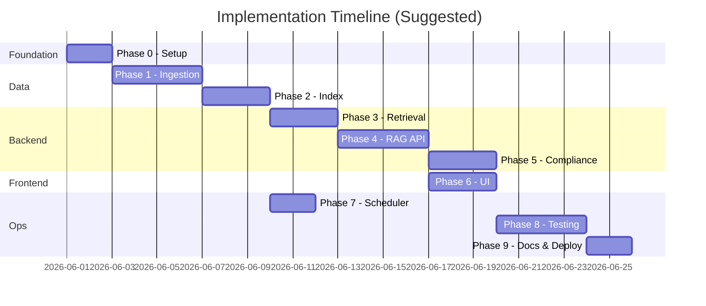

# Implementation Plan: Mutual Fund FAQ Assistant

This document defines a **phase-wise implementation plan** for the facts-only RAG assistant described in [problemStatement.md](./problemStatement.md) and [architecture.md](./architecture.md).

---

## Overview

| Item | Detail |
|------|--------|
| **Product** | Facts-only FAQ assistant for HDFC Mutual Fund schemes (Groww reference context) |
| **AMC** | HDFC Mutual Fund |
| **Corpus** | 5 Groww scheme URLs |
| **Approach** | Lightweight RAG with query classification, source-backed answers, and daily ingestion |
| **Stack** | Node.js + TypeScript, Express, ChromaDB (JS client), local BGE-small embeddings (`@xenova/transformers`), Groq LLM |
| **Primary deliverable** | Working chat assistant + README + automated daily corpus refresh |

### Phase summary

| Phase | Focus | Outcome |
|-------|--------|---------|
| [Phase 0](#phase-0--project-foundation) | Project foundation | Repo scaffold, config, dependencies |
| [Phase 1](#phase-1--corpus--ingestion-pipeline) | Corpus & ingestion | Parsed, chunked data from 5 URLs |
| [Phase 2](#phase-2--embedding--vector-index) | Embedding & index | Searchable vector store + metadata index |
| [Phase 3](#phase-3--retrieval-layer) | Retrieval layer | Scheme-aware chunk retrieval |
| [Phase 4](#phase-4--rag-backend--api) | RAG backend & API | Grounded answers via `POST /api/chat` |
| [Phase 5](#phase-5--compliance-layer) | Compliance layer | Classifier, refusals, validator, formatter |
| [Phase 6](#phase-6--ui) | UI | Minimal chat interface with disclaimer |
| [Phase 7](#phase-7--daily-scheduler) | Daily scheduler | Automated once-daily ingestion |
| [Phase 8](#phase-8--testing--quality-assurance) | Testing & QA | Automated tests + manual query matrix |
| [Phase 9](#phase-9--documentation--deployment) | Docs & deployment | README, runbooks, local/prod setup |



> **Note:** Phases 6 and 7 can run in parallel once Phase 4 is stable. Phase 7 only requires Phase 2 (index exists); it does not block the chat API.

---

## Phase 0 — Project Foundation

**Goal:** Establish project structure, configuration, and development environment.

### Tasks

- [ ] Create directory layout per [architecture.md §13](./architecture.md#13-project-structure-suggested)
- [ ] Initialize Node project (`npm init`); add `package.json` + `tsconfig.json` (strict TypeScript)
- [ ] Add core dependencies: `express`, `chromadb`, `@xenova/transformers`, `groq-sdk`, `cheerio`, `zod`, `dotenv`, `js-yaml`; dev: `typescript`, `tsx`, `@types/*`, `vitest`
- [ ] Add npm scripts: `dev` (tsx watch), `build` (tsc), `start`, `ingest` (`tsx src/ingestion/run.ts`)
- [ ] Create `config/corpus.yaml` with all 5 scheme URLs, slugs, categories, and aliases
- [ ] Add `.env.example` for API keys (`GROQ_API_KEY`, `LLM_MODEL`, `EMBEDDING_MODEL`)
- [ ] Add `.gitignore` (exclude `node_modules/`, `.env`, `dist/`, `data/index/`, raw HTML caches if large)
- [ ] Create empty `data/raw/`, `data/processed/`, `data/index/` directories

### Deliverables

| Artifact | Location |
|----------|----------|
| Corpus config | `config/corpus.yaml` |
| Environment template | `.env.example` |
| Dependency manifest | `package.json` + `tsconfig.json` |

### Exit criteria

- Project installs cleanly with `npm install` and `npm run build` compiles without TS errors
- `corpus.yaml` lists all 5 schemes with correct Groww URLs
- Express app starts with a health endpoint (`GET /health`)

### Dependencies

None.

---

## Phase 1 — Corpus & Ingestion Pipeline

**Goal:** Fetch and parse the five Groww scheme pages into structured, section-tagged content.

### Tasks

- [ ] **`src/ingestion/fetch.ts`** — HTTP GET each corpus URL (`fetch`/`undici`); save raw HTML/markdown to `data/raw/` with fetch timestamp
- [ ] **`src/ingestion/parse.ts`** — Strip navigation, footers, and duplicate chrome with Cheerio; extract scheme-specific content
- [ ] **Section extraction** — Tag content into sections defined in architecture:
  - `overview`, `expense_ratio`, `exit_load`, `minimum_investment`, `benchmark`, `tax`, `fund_management`, `investment_objective`, `fund_house`
- [ ] **`src/ingestion/chunk.ts`** — Section-aware chunking (see [Chunking strategy](#chunking-strategy-phase-1) below)
- [ ] **`src/ingestion/run.ts`** — CLI entrypoint: `npm run ingest` runs fetch → parse → chunk and writes to `data/processed/`
- [ ] Validate parsed output for all 5 schemes (automated via `validateAllChunks()` in `src/ingestion/chunk.ts`)

### Chunking strategy (Phase 1)

Chunk from **`sections.json`**, not `cleaned.txt`. Parsed section text is ~1.7–2.4k chars per scheme; `cleaned.txt` (~16–19k chars) includes holdings, comparisons, and chrome unsuitable for FAQ retrieval.

| Rule | Detail |
|------|--------|
| **Source** | `data/processed/{slug}/sections.json` only |
| **Default** | One chunk per section (8 sections × 5 schemes) |
| **`fund_management`** | Split **one chunk per fund manager**; keep each bio intact |
| **Overlap** | None between sections (sections are already small) |
| **Max size** | ~400 tokens (~1600 chars); split on paragraph boundaries only if exceeded |
| **Chunk text prefix** | `Scheme:`, `Section:`, `Source:` header for embedding context |
| **Chunk ID** | `{slug}#{section}#{index}` (e.g. `hdfc-mid-cap-fund-direct-growth#fund_management#0`) |
| **Exclude** | `cleaned.txt` bulk text, `funds_managed` lists, performance/holdings tables |

**Expected corpus size:** ~52–55 chunks total (45 section chunks + ~7–10 manager sub-chunks).

**Chunk metadata fields:** `id`, `text`, `scheme_name`, `source_url`, `section`, `last_updated`, `manager_name` (optional), `token_estimate`

### Corpus URLs (reference)

| Scheme | URL |
|--------|-----|
| HDFC Mid Cap Fund Direct Growth | https://groww.in/mutual-funds/hdfc-mid-cap-fund-direct-growth |
| HDFC Large Cap Fund Direct Growth | https://groww.in/mutual-funds/hdfc-large-cap-fund-direct-growth |
| HDFC Small Cap Fund Direct Growth | https://groww.in/mutual-funds/hdfc-small-cap-fund-direct-growth |
| HDFC Gold ETF FoF Direct Plan Growth | https://groww.in/mutual-funds/hdfc-gold-etf-fund-of-fund-direct-plan-growth |
| HDFC Defence Fund Direct Growth | https://groww.in/mutual-funds/hdfc-defence-fund-direct-growth |

### Deliverables

| Artifact | Location |
|----------|----------|
| Raw fetched pages | `data/raw/<slug>.html` or `.md` |
| Parsed sections | `data/processed/<slug>/sections.json` |
| Chunks (pre-embed) | `data/processed/<slug>/chunks.json` |

### Exit criteria

- [ ] All 5 URLs fetch successfully without manual intervention
- [ ] Each scheme has chunks for `expense_ratio`, `exit_load`, `minimum_investment`, `benchmark`, and `fund_management`
- [ ] Chunk metadata includes `scheme_name`, `source_url`, `section`, `last_updated`
- [ ] `npm run ingest` completes fetch → parse → chunk with validation passing

### Dependencies

Phase 0.

---

## Phase 2 — Embedding & Vector Index

**Goal:** Embed chunks and persist a searchable vector store plus scheme metadata index.

### Embedding model choice

Use a **free local BGE model** via `@xenova/transformers` (Transformers.js — runs ONNX in Node, no paid embedding API).

| Model | Dims | Fit for this project |
|-------|------|----------------------|
| **`Xenova/bge-small-en-v1.5`** (recommended) | 384 | Best default: 51 short chunks (avg ~82 tokens, max ~140); fast CPU inference; ~78 KB vector storage |
| `Xenova/bge-large-en-v1.5` | 1024 | Optional upgrade if retrieval quality is insufficient; marginal gain on tiny factual chunks |

**Why BGE-small over BGE-large here:**

- Chunks are short, section-tagged, and scheme-filtered — retrieval is as much metadata matching as semantic search
- Corpus is only **51 chunks**; storage difference is negligible either way (~78 KB vs ~208 KB)
- BGE-small is faster at daily re-index and query time, with smaller model download (~130 MB vs ~1.3 GB)
- BGE models support a query prefix for retrieval: prepend `"Represent this sentence for searching relevant passages: "` to user queries
- Wrap the pipeline in a custom Chroma `IEmbeddingFunction` so both ingestion and query paths share one embedder

**Config:** `EMBEDDING_MODEL=Xenova/bge-small-en-v1.5`

### Vector store choice

Use **ChromaDB** (local, persistent) — not FAISS.

| Criterion | ChromaDB | FAISS |
|-----------|----------|-------|
| Corpus size (51 chunks) | Ideal | Over-engineered |
| Metadata filtering (`section`, `source_url`) | Built-in | Requires separate store |
| Persistence / upsert by chunk ID | Native | Manual |
| Daily re-index swap | Collection swap via `active.json` | Extra plumbing |
| Node JS client | `chromadb` (talks to local Chroma server) | N/A |

> **Note (JS client):** ChromaDB's Node client requires a running Chroma server (`chroma run --path data/index/chroma`, or via Docker), unlike Python's in-process `PersistentClient`. Start it alongside the app/scheduler.

**Layout:**

```
data/index/
├── active.json          # pointer to active Chroma collection
└── chroma/              # Chroma persistent storage
data/processed/metadata.json   # scheme-level metadata index
```

### Tasks

- [ ] **`src/ingestion/index.ts`** — Load chunks from `data/processed/`, generate embeddings, upsert into Chroma
- [ ] **`src/lib/embeddings.ts`** — Local embedding function (`Xenova/bge-small-en-v1.5` via `@xenova/transformers`) implementing Chroma's `IEmbeddingFunction`
- [ ] Initialize Chroma collection (server at `data/index/chroma/`)
- [ ] Build **scheme metadata index** (`data/processed/metadata.json`) with slug, name, category, `source_url`, `last_fetched_at`
- [ ] Implement index swap strategy: new collection → update `active.json` → delete old collections
- [ ] Add idempotent re-index via `reindexInPlace()` (upsert + stale ID removal)

### Deliverables

| Artifact | Location |
|----------|----------|
| Vector store | `data/index/` |
| Metadata index | `data/processed/metadata.json` |

### Exit criteria

- [ ] Index contains ~50–150 chunks across 5 schemes
- [ ] Semantic search returns relevant chunks for sample queries ("expense ratio mid cap", "fund manager defence")
- [ ] Metadata index resolves all 5 slugs to correct `source_url`
- [ ] `npm run ingest -- --index-only` builds Chroma index and validates successfully

### Dependencies

Phase 1.

---

## Phase 3 — Retrieval Layer

**Goal:** Implement scheme-aware retrieval over the indexed corpus with high precision on factual FAQ queries.

### Retrieval strategy (Phase 3)

**Do not use pure semantic search.** Probe results on the live index show:

| Query pattern | Semantic-only result | Problem |
|---------------|---------------------|---------|
| `"expense ratio mid cap"` | Correct `expense_ratio` @ Mid Cap (d≈0.45) | Works when scheme is in query |
| `"exit load defence fund"` | Correct `exit_load` @ Defence (d≈0.40) | Works |
| `"expense ratio"` (no scheme) | 5 tied `expense_ratio` chunks (d≈0.58 each) | **Ambiguous — must not pick one** |
| `"HDFC fund"` | Scattered `investment_objective` across schemes | **Ambiguous** |

**Conclusion:** Use a **3-stage filter-first pipeline** — metadata resolution before vector search. Semantic search ranks *within* a pre-filtered set; it does not choose the scheme alone.

```
User query
    → Stage 1: Scheme resolution (rules + aliases from metadata.json)
    → Stage 2: Section intent detection (keyword → section tag)
    → Stage 3: Chroma query (BGE query embedding + metadata where clause)
    → Structured result { chunks, scheme_name, source_url, last_updated, status }
```

#### Stage 1 — Scheme resolution (rule-based)

Source: `data/processed/metadata.json` (`slug`, `scheme_name`, `aliases`, `source_url`).

| Priority | Match rule | Example |
|----------|------------|---------|
| 1 | Groww URL or slug in query | `hdfc-mid-cap-fund-direct-growth` |
| 2 | Full `scheme_name` substring (case-insensitive) | `HDFC Mid Cap Fund Direct Growth` |
| 3 | Longest matching alias | `defence`, `gold etf`, `mid cap` |
| 4 | No unique match | Return `status: ambiguous_scheme` — list 5 supported schemes; **no retrieval** |
| 5 | Known non-corpus AMC/scheme | Return `status: out_of_scope` |

**Tie-breaking:** If multiple schemes match (e.g. query is only `"HDFC fund"`), do **not** guess — treat as ambiguous.

#### Stage 2 — Section intent detection (keyword rules)

Map query keywords to a single `section` tag (first strong match wins):

| Section tag | Trigger keywords |
|-------------|------------------|
| `expense_ratio` | expense ratio, expense, ter |
| `exit_load` | exit load, redemption charge, exit fee |
| `minimum_investment` | minimum sip, min sip, sip amount, minimum investment, lumpsum |
| `benchmark` | benchmark, index benchmark |
| `fund_management` | fund manager, manages, manager, tenure, education, experience, who manages |
| `tax` | tax, stamp duty, capital gains, ltcg, stcg |
| `investment_objective` | objective, investment objective, goal |
| `fund_house` | amc, fund house, registrar |
| `overview` | nav, aum, fund size, risk, rating, category |

If no section detected → search within scheme only (no section filter), `k=3`.

**Fund manager sub-queries:** When section is `fund_management` and a manager name appears in the query, optionally filter/post-select by `manager_name` metadata.

#### Stage 3 — Chroma vector search (BGE-small)

Use the `queryIndex()` helper with the BGE query prefix. Apply metadata filters via `$and` when multiple fields:

| Resolved scheme | Resolved section | Chroma `where` | `k` |
|-----------------|------------------|----------------|-----|
| Yes | Yes | `{ slug, section }` | **1** (except `fund_management`: **3**) |
| Yes | No | `{ slug }` | **3** |
| No | — | — | **Do not query** |

**Distance threshold (slug-only fallback):** Reject top hit if distance > **0.55** (calibrated from probes); return insufficient context.

**Why hard filters beat "section boosting":** Each non-manager section has exactly **1 chunk per scheme**. Filtering by `slug + section` is deterministic; boosting is unnecessary when metadata is available.

#### Return contract (`src/app/retriever.ts`)

```typescript
type RetrievalResult = {
  status: "ok" | "ambiguous_scheme" | "out_of_scope" | "insufficient_context";
  schemeName: string | null;
  sourceUrl: string | null;
  lastUpdated: string | null;
  chunks: Array<{
    id: string;
    text: string;
    section: string;
    distance: number;
    managerName: string | null;
  }>;
};
```

Citation URL always comes from resolved scheme metadata, not from vector ranking.

#### What we are NOT doing in Phase 3

- No cross-encoder reranker (51 chunks — unnecessary)
- No BM25 hybrid (section metadata replaces sparse search)
- No multi-scheme retrieval in one answer
- No guessing scheme when query is ambiguous

### Tasks

- [ ] **`src/app/retriever.ts`** — Implement 3-stage pipeline above
- [ ] **`src/app/schemeResolver.ts`** — Alias/slug matching from `metadata.json`
- [ ] **`src/app/sectionIntent.ts`** — Keyword → section tag mapping
- [ ] Wire to `queryIndex()` (in `src/ingestion/index.ts`) with normalized `$and` filters
- [ ] Return structured result: `{ status, chunks, schemeName, sourceUrl, lastUpdated }`
- [ ] Handle ambiguous scheme queries: list supported schemes, empty chunks
- [ ] Handle out-of-corpus schemes: explicit scope message

### Test queries (manual)

| Query | Expected scheme | Expected section |
|-------|-----------------|------------------|
| Expense ratio of HDFC Mid Cap Fund | Mid Cap | `expense_ratio` |
| Exit load on Defence Fund | Defence | `exit_load` |
| Who manages Gold ETF FoF? | Gold ETF FoF | `fund_management` |
| Minimum SIP for Small Cap | Small Cap | `minimum_investment` |
| Benchmark of Large Cap Fund | Large Cap | `benchmark` |

### Exit criteria

- [ ] Retrieval precision ≥ 80% on the manual query set above
- [ ] Correct `source_url` attached for citation in all resolved cases
- [ ] Out-of-corpus query returns no fabricated chunks
- [ ] Ambiguous queries (`expense ratio` without scheme) return `ambiguous_scheme` with no chunks

### Dependencies

Phase 2.

---

## Phase 4 — RAG Backend & API

**Goal:** Wire retrieval to Groq LLM generation and expose a chat API.

### LLM provider

| Setting | Value |
|---------|-------|
| Provider | **Groq** (`LLM_PROVIDER=groq`) |
| SDK | `groq-sdk` (Node) |
| API key | `GROQ_API_KEY` |
| Default model | `llama-3.1-8b-instant` (fast; override via `LLM_MODEL`) |
| Alternatives | `llama-3.3-70b-versatile` for higher quality |

Embeddings remain local (BGE-small); only answer generation uses Groq.

### Tasks

- [ ] **`src/app/generator.ts`** — Groq chat completion (`groq-sdk`) with facts-only system prompt (max 3 sentences, context-only)
- [ ] Assemble user prompt with retrieved chunks, source URLs, and dates
- [ ] **`src/app/server.ts`** — Express app with `POST /api/chat` accepting `{ "message": string }`
- [ ] **`src/app/rag.ts`** (orchestrator) — Coordinate retriever → generator flow for factual queries
- [ ] Return structured JSON per architecture contract:

```json
{
  "answer": "...",
  "citation_url": "https://groww.in/mutual-funds/...",
  "last_updated": "2026-05-29",
  "is_refusal": false,
  "disclaimer": "Facts-only. No investment advice."
}
```

- [ ] Add CORS for local UI development (`cors` middleware)
- [ ] Log query, scheme resolved, chunk IDs used (no PII)
- [ ] **`src/app/schemas.ts`** — Zod request/response schemas + inferred types
- [ ] Config: `GROQ_API_KEY`, `LLM_PROVIDER`, `LLM_MODEL` in `.env.example`

### Exit criteria

- Factual questions return grounded answers for all 5 schemes
- API p95 latency < 5 s (including Groq LLM call)
- Answers cite the correct Groww scheme URL
- Fund management questions return manager names/tenure from retrieved context

### Dependencies

Phase 3.

---

## Phase 5 — Compliance Layer

**Goal:** Enforce facts-only policy via classification, refusal handling, validation, and response formatting.

### Tasks

- [ ] **`src/app/classifier.ts`** — Rule-based classifier (Phase 5a) for:
  - Factual → RAG
  - Advisory → refusal
  - Comparison → refusal
  - Performance-seeking → link-only or refusal
  - Out of scope → scope explanation
- [ ] **`src/app/refusal.ts`** — Polite templates with AMFI/SEBI educational link
- [ ] **`src/app/validator.ts`** — Post-generation checks:
  - ≤ 3 sentences
  - Citation URL in allowlist (5 corpus URLs or fixed AMFI/SEBI for refusals)
  - No advisory language
  - Grounding against retrieved chunks
  - No performance comparisons or return calculations
- [ ] **`src/app/formatter.ts`** — Enforce footer: `Last updated from sources: <date>`
- [ ] **`src/app/piiGuard.ts`** — Reject or strip PAN, Aadhaar, account numbers, OTP, email, phone patterns before processing
- [ ] Wire classifier before RAG in `POST /api/chat` flow

### Refusal test cases

| Input | Expected |
|-------|----------|
| "Should I invest in HDFC Mid Cap Fund?" | Refusal + AMFI/SEBI link |
| "Which is better, mid cap or large cap?" | Refusal + educational link |
| "What returns will I get in 3 years?" | Refusal or link-only to scheme page |
| "Compare expense ratios and tell me which to buy" | Refusal (comparison + advisory) |

### Exit criteria

- All refusal test cases pass consistently
- No advisory language in factual responses
- Every response has exactly one citation URL and disclaimer
- Performance queries never include calculated or comparative returns

### Dependencies

Phase 4.

### Maps to success criteria

- [ ] Strict adherence to facts-only responses
- [ ] Proper refusal of advisory queries
- [ ] Consistent inclusion of valid source citations

---

## Phase 6 — UI

**Goal:** Deliver a minimal, user-friendly chat interface per problem statement.

### Tasks

- [ ] **`ui/index.html`** — Single-page chat styled with the Grow RAG design system (`stitch_grow_rag_chat_ui/`)
- [ ] Welcome message explaining facts-only scope and supported schemes
- [ ] Visible disclaimer: **"Facts-only. No investment advice."**
- [ ] Three clickable example questions:
  1. *What is the expense ratio of HDFC Mid Cap Fund Direct Growth?*
  2. *What is the exit load on HDFC Defence Fund Direct Growth?*
  3. *Who manages HDFC Gold ETF Fund of Fund Direct Plan Growth?*
- [ ] Chat input + send button; render assistant replies with citation link and last-updated footer
- [ ] Loading state while API responds
- [ ] No fields for email, phone, PAN, or account numbers
- [ ] Serve UI via Express static middleware (`GET /`, `/assets/*`)

### Exit criteria

- End-to-end flow works: example question → API → rendered answer with citation and footer
- Disclaimer always visible
- UI is usable on desktop and mobile viewport

### Dependencies

Phase 4 (API stable). Phase 5 recommended before demo.

### Maps to success criteria

- [ ] Clean, minimal, and user-friendly interface

---

## Phase 7 — Daily Scheduler

**Goal:** Automate corpus refresh with a once-daily ingestion trigger at **10:00 AM IST**.

### Schedule

| Setting | Default | Description |
|---------|---------|-------------|
| `INGESTION_SCHEDULE_HOUR` | `10` | Hour in local schedule timezone |
| `INGESTION_SCHEDULE_MINUTE` | `0` | Minute in local schedule timezone |
| `INGESTION_SCHEDULE_TIMEZONE` | `Asia/Kolkata` | IANA timezone (IST) |

Equivalent UTC cron: `30 4 * * *` (10:00 AM IST = 04:30 UTC).

### Tasks

- [ ] **`src/scheduler/daily.ts`** — Wrapper that invokes the `src/ingestion/run.ts` pipeline (fetch → parse → chunk → index)
- [ ] Configure schedule time via `INGESTION_SCHEDULE_HOUR`, `INGESTION_SCHEDULE_MINUTE`, `INGESTION_SCHEDULE_TIMEZONE`
- [ ] Log job start, completion, URLs fetched, chunk count, errors
- [ ] Retry once on failure; log final status
- [ ] Scheduler mechanisms:
  - **Local/dev:** `npm run schedule` (node-cron daemon) or `crontab.example`
  - **CI:** `.github/workflows/daily-ingestion.yml`
- [ ] Document manual override: `npm run schedule -- --once` or `npm run ingest`
- [ ] Index swap from Phase 2 keeps live index serving during failed builds

### Deliverables

| Artifact | Location |
|----------|----------|
| Scheduler script | `src/scheduler/daily.ts` |
| Cron example | `crontab.example` |
| GitHub Actions workflow | `.github/workflows/daily-ingestion.yml` |

### Exit criteria

- Scheduled job runs successfully end-to-end at least once
- `last_fetched_at` in metadata index updates after run
- Failed run produces actionable logs without breaking the live index

### Dependencies

Phase 2 (index pipeline). Can proceed in parallel with Phases 4–6.

---

## Phase 8 — Testing & Quality Assurance

**Goal:** Automated tests and a manual evaluation matrix covering all query types and compliance rules.

### Tasks

- [ ] **`tests/classifier.test.ts`** — Advisory, comparison, factual, performance, out-of-scope labels
- [ ] **`tests/retrieval.test.ts`** — Scheme resolution and section retrieval for all 5 schemes
- [ ] **`tests/refusal.test.ts`** — Refusal templates and AMFI/SEBI links
- [ ] **`tests/validator.test.ts`** — Sentence limit, citation allowlist, advisory language detection
- [ ] **`tests/formatter.test.ts`** — Footer format, disclaimer presence
- [ ] **`tests/api.test.ts`** — Integration tests for `POST /api/chat` (Supertest)
- [ ] **Manual evaluation matrix** — Run 30+ queries covering:

| Category | # Queries | Pass criterion |
|----------|-----------|----------------|
| Expense ratio | 5 | Correct value + citation |
| Exit load | 5 | Correct rules + citation |
| Minimum SIP | 5 | Correct amount + citation |
| Benchmark | 3 | Correct index + citation |
| Fund management | 5 | Manager names/tenure + citation |
| Advisory refusals | 5 | Polite refusal + educational link |
| Performance / comparison | 5 | Refusal or link-only |

### Exit criteria

- All automated tests pass in CI
- Manual matrix ≥ 90% pass rate on factual queries
- 100% pass rate on advisory/comparison refusals

### Dependencies

Phases 5, 6, 7.

### Maps to success criteria

- [ ] Accurate retrieval of factual mutual fund information, including fund management data

---

## Phase 9 — Documentation & Deployment

**Goal:** Complete README, runbooks, and runnable local/production setup.

### Tasks

- [x] **`README.md`** with:
  - Project overview and disclaimer snippet
  - Setup instructions (`npm install`, env vars, Chroma server, run)
  - Selected AMC (HDFC Mutual Fund) and 5 schemes
  - Architecture overview (link to `architecture.md`)
  - How to run ingestion manually and via scheduler
  - Known limitations (5-URL corpus, Groww as source, daily refresh lag)
- [x] Runbook for failed ingestion (check logs, re-run manually, verify index)
- [x] Local run instructions: start Chroma server + API + UI + one-time index build
- [x] Optional: Dockerfile (+ docker-compose for app + Chroma) with volume-mounted `data/index/`
- [x] Final review against [problemStatement.md success criteria](./problemStatement.md#success-criteria)

### Exit criteria

- New developer can clone repo, `npm install`, configure `.env`, start Chroma, build index, start API + UI, and ask a question in < 30 minutes
- README accurately reflects current scope and limitations
- All success criteria from problem statement verified and checked off

### Dependencies

Phases 0–8.

---

## Success Criteria Checklist

Mapped from [problemStatement.md](./problemStatement.md):

| Criterion | Phase(s) |
|-----------|----------|
| Accurate retrieval of factual mutual fund information, including fund management data | 2, 3, 8 |
| Strict adherence to facts-only responses | 4, 5, 8 |
| Consistent inclusion of valid source citations | 4, 5, 6, 8 |
| Proper refusal of advisory queries | 5, 8 |
| Clean, minimal, and user-friendly interface | 6 |

---

## Risk Register

| Risk | Impact | Mitigation | Phase |
|------|--------|------------|-------|
| Groww HTML structure changes | Ingestion breaks | Robust selectors; fallback to cached markdown; daily scheduler alerts | 1, 7 |
| LLM hallucination beyond context | Incorrect facts | Strict prompt + validator grounding check | 4, 5 |
| Ambiguous scheme in query | Wrong citation | Scheme resolution aliases; future clarification turn | 3 |
| Rate limits on Groww fetch | Ingestion failure | Retry with backoff; respect robots/rate limits | 1, 7 |
| Advisory queries slip through classifier | Compliance violation | Rule-based guardrails first; expand test suite | 5, 8 |
| Index rebuild during chat | Stale or empty answers | Atomic index swap; serve previous index until swap completes | 2, 7 |

---

## Out of Scope (Current Plan)

Per problem statement and architecture:

- Expanding corpus to 15–25 AMC / AMFI / SEBI URLs
- User accounts, chat history persistence, or PII collection
- Performance comparisons, return calculations, or investment recommendations
- Multilingual support
- Admin dashboard for ingestion monitoring
- ELSS lock-in and document download guides (not in current 5-URL corpus)

These are listed as [future extensions in architecture.md §12](./architecture.md#12-future-extensions-out-of-current-scope).

---

## Quick Start Order (Developer Checklist)

For a single developer building sequentially:

1. **Phase 0** — Scaffold Node/TS project (`npm init`, tsconfig) and config
2. **Phase 1** — Build ingestion (`src/ingestion/*.ts`); verify parsed chunks for all 5 schemes
3. **Phase 2** — Embed (BGE via `@xenova/transformers`) and index into Chroma
4. **Phase 3** — Test retrieval in isolation
5. **Phase 4** — Add Groq LLM (`groq-sdk`) + Express `POST /api/chat`
6. **Phase 5** — Add classifier, refusals, validator, formatter
7. **Phase 6** — Build UI and connect to API
8. **Phase 7** — Wire daily scheduler (node-cron)
9. **Phase 8** — Tests (Vitest) + manual evaluation matrix
10. **Phase 9** — README and final deployment notes

---

## Summary

Implementation proceeds from **data ingestion and indexing** (Phases 1–2) through **retrieval and RAG** (Phases 3–4), then **compliance hardening** (Phase 5) and **UI** (Phase 6). A **daily scheduler** (Phase 7) keeps the corpus fresh without blocking the chat API. **Testing** (Phase 8) and **documentation** (Phase 9) validate the system against the facts-only, source-backed requirements in the problem statement. The plan prioritizes a working end-to-end demo early (after Phase 6) while deferring corpus expansion and advanced features to future work.
